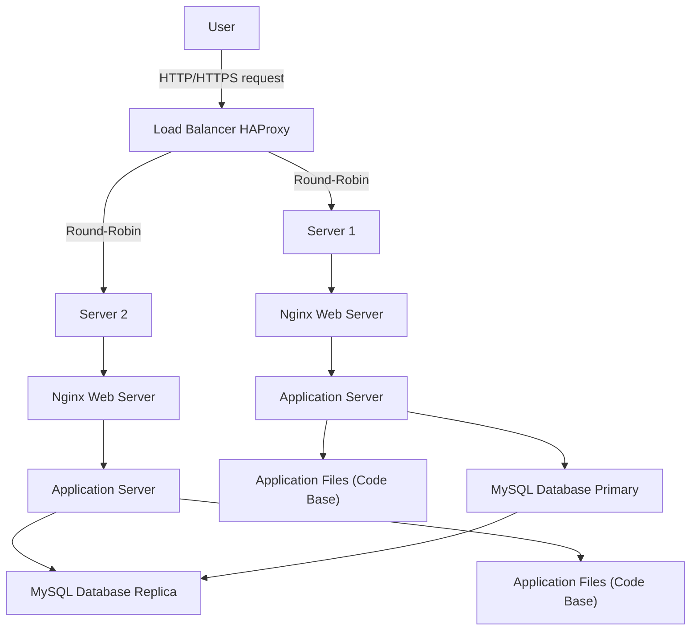

# Three-Server Web Infrastructure for www.foobar.com

This diagram shows a web infrastructure with a load balancer, two servers, and a database setup.

## Explanation

* **User**: The client requesting the website via browser.
* **Load Balancer (HAProxy)**: Distributes incoming HTTP/HTTPS requests across Server 1 and Server 2.

  * Algorithm used: Round-Robin (alternates requests evenly).
  * Active-Active setup: both servers handle traffic simultaneously.
* **Server 1 & Server 2**: Each contains:

  * **Nginx Web Server**: Handles HTTP/HTTPS requests and static content.
  * **Application Server**: Runs business logic (code base).
  * **Application Files**: The actual website code.
  * **Database connection**: Access to MySQL.
* **Database (Primary & Replica)**:

  * **Primary**: Accepts all writes.
  * **Replica**: Receives replicated data from Primary, mainly for read operations.
  * Ensures better read scalability and redundancy.

## Potential Issues

* **SPOF**: Load balancer is a single point of failure. If it fails, the website is unreachable.
* **Security**: No firewall or HTTPS configured in this setup.
* **No monitoring**: Cannot detect server or database failures automatically.
* **Scaling**: Without additional servers, high traffic can overwhelm Server 1 and Server 2.
