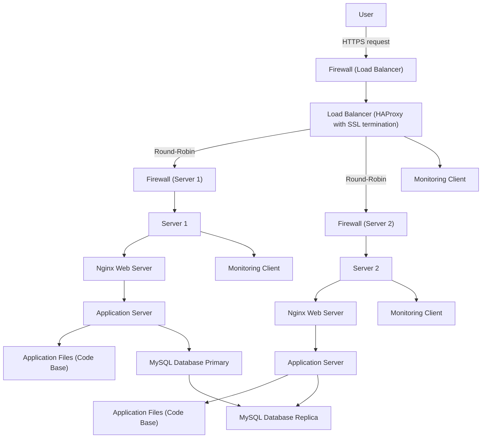

# Secure and Monitored Web Infrastructure for www.foobar.com

This diagram shows a secured and monitored three-server web infrastructure with a load balancer, firewalls, HTTPS, and monitoring clients.

---

## Explanation

### Added Elements

* **Firewalls (3 total)**

  * One in front of the load balancer
  * One in front of each server
  * They protect the infrastructure by filtering network traffic and allowing only safe ports (e.g., 80/443 for HTTP/HTTPS, 3306 for MySQL).

* **SSL Certificate**

  * Enables **HTTPS** for [www.foobar.com](http://www.foobar.com).
  * Ensures that all communication between the user and the load balancer is encrypted.

* **Monitoring Clients (3 total)**

  * Installed on Server 1, Server 2, and the load balancer.
  * They collect logs and metrics (CPU, memory, QPS, error rates) and send them to a centralized monitoring tool (e.g., Sumologic).

### Why HTTPS?

* Protects confidentiality and integrity of data.
* Prevents man-in-the-middle attacks.

### Why Monitoring?

* Detects failures, performance issues, or suspicious activity.
* Monitoring QPS (Queries Per Second) allows you to measure real traffic load and scale infrastructure when needed.

---

## Potential Issues

* **SSL Termination at Load Balancer**
  Traffic between the load balancer and servers is not encrypted. Internal sniffing could expose sensitive data.

* **Only One Primary Database**
  All writes go to the primary. If it fails, no write operations are possible (Single Point of Failure).

* **Identical Servers (DB + Web + App on each)**
  Mixing roles makes scaling and maintenance harder. Database load could affect web/app performance.
