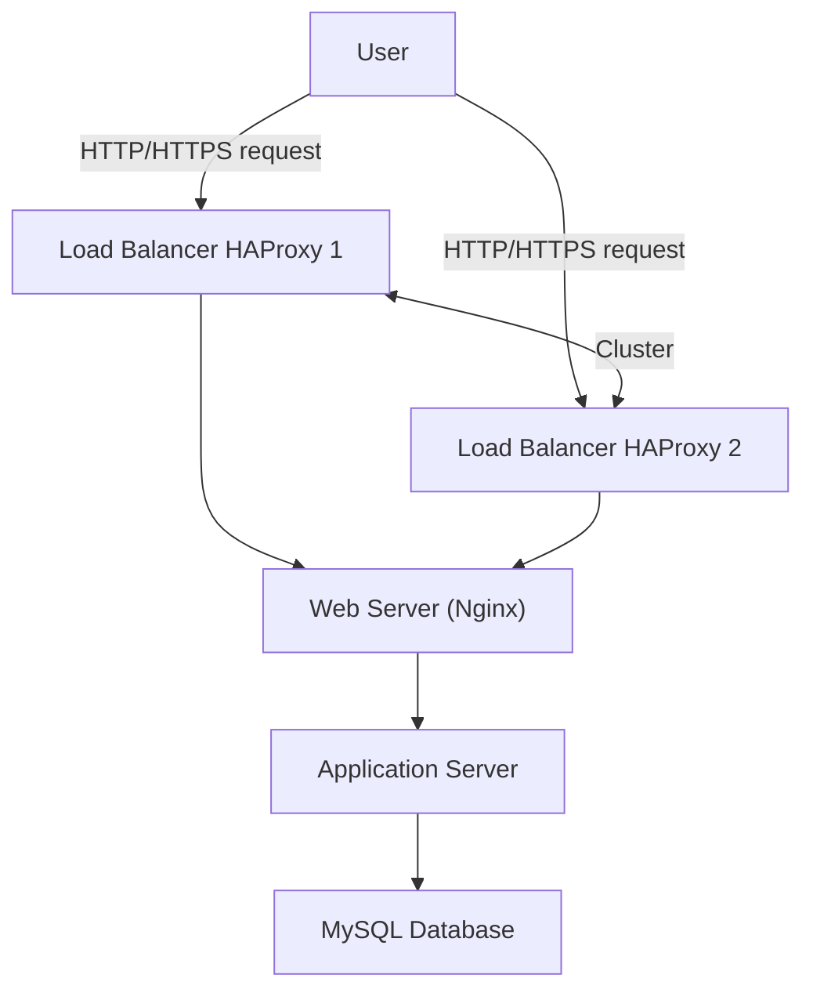

# Application Server vs Web Server Infrastructure

This design introduces an infrastructure where components are split into their own dedicated servers, and the load balancer is configured in a cluster for redundancy.

---

## Explanation

* **User**: Client accessing the website via browser.
* **Load Balancers (HAProxy 1 & 2)**:

  * Configured as a cluster to avoid a **single point of failure**.
  * Distribute incoming traffic across backend servers.
* **Web Server (Nginx)**:

  * Serves static content (HTML, CSS, JS, images).
  * Acts as a **reverse proxy** to forward dynamic requests to the application server.
* **Application Server**:

  * Runs the business logic (your code base).
  * Processes requests and communicates with the database.
* **Database (MySQL)**:

  * Stores and manages persistent data for the application.

---

## Why Each Component Was Added

* **Load Balancer Cluster**: Prevents downtime if one load balancer fails.
* **Web Server**: Optimized for handling HTTP requests and static files.
* **Application Server**: Separates application logic from static content for performance and scalability.
* **Database Server**: Centralized data storage, isolated from other services.

---

## Benefits of Splitting Components

* **Performance**: Nginx handles high numbers of HTTP requests efficiently, while the app server focuses only on business logic.
* **Security**: Only Nginx is exposed to the internet; the application server and database are hidden behind it.
* **Scalability**: Each component can be scaled independently (e.g., add more app servers without touching the DB).
